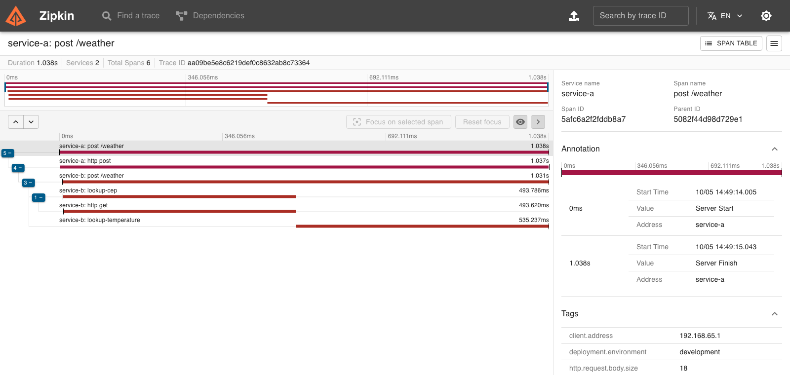

# Zipcode to Temperature — OpenTelemetry + Zipkin


> This project is part of the [FullCycle](https://fullcycle.com.br/) learning program (Pós-Graduação).

Two Go microservices that turn a Brazilian postal code (CEP) into the current temperature of its city, in Celsius,
Fahrenheit and Kelvin. The point of the exercise is **observability**: every request is traced end to end with
OpenTelemetry, through an OTEL Collector, into Zipkin.

## Table of Contents

- [What the system does](#what-the-system-does)
- [Quick start](#quick-start)
- [API](#api)
- [Viewing traces in Zipkin](#viewing-traces-in-zipkin)
- [Configuration](#configuration)
- [Architecture](#architecture)
- [Development and tests](#development-and-tests)
- [Troubleshooting](#troubleshooting)
- [External APIs and conversions](#external-apis-and-conversions)
- [Challenge requirements (coverage)](#challenge-requirements-coverage)

## What the system does

```
Client  POST /weather {"cep":"29902555"}
   │
   ▼
Service A :8080            input: validates the CEP (string, exactly 8 digits)
   │  POST /weather
   ▼
Service B :8081            orchestration
   ├── ViaCEP      → city          (manual span: lookup-cep)
   ├── WeatherAPI  → temp in °C    (manual span: lookup-temperature)
   └── converts to °F and K

Both services ──OTLP/HTTP──▶ OTEL Collector ──▶ Zipkin :9411   (one trace per request)
```

| Component      | Host port | Role                                                                                |
|----------------|-----------|-------------------------------------------------------------------------------------|
| Service A      | `8080`    | Public entry point. Validates input and forwards valid CEPs to Service B.            |
| Service B      | —         | Internal. Looks up the city, gets the temperature, converts it. Reachable only by A. |
| OTEL Collector | —         | Receives OTLP traces from both services and exports them to Zipkin.                  |
| Zipkin         | `9411`    | Trace storage (in memory) and UI.                                                    |

Only `8080` and `9411` are published on the host; everything else stays on the internal Docker network.

## Quick start

**Prerequisites:** [Docker](https://docs.docker.com/get-docker/) with Compose, and a free API key from
[WeatherAPI.com](https://www.weatherapi.com/).

1. Clone the repository

   ```bash
   git clone https://github.com/bianavic/fullcycle_go_tracing.git
   cd fullcycle_go_tracing
   ```

2. Configure the API key (see [Configuration](#configuration) for every variable)

   ```bash
   cp .env.example .env
   # edit .env and set WEATHER_API_KEY=<your key>
   ```

3. Build and start the whole ecosystem (Service A, Service B, OTEL Collector, Zipkin)

   ```bash
   docker compose up --build        # add -d to run in the background
   ```

   `docker compose up --build --wait` returns once every container with a healthcheck is healthy.

4. Send a request

   ```bash
   curl -i -X POST http://localhost:8080/weather \
     -H 'Content-Type: application/json' \
     -d '{"cep":"29902555"}'
   ```

   ```http
   HTTP/1.1 200 OK
   Content-Type: application/json; charset=utf-8
   X-Request-Id: b8948725-f7f5-4b05-be76-a6c58595db25

   {"city":"Linhares","temp_C":26.2,"temp_F":79.2,"temp_K":299.2}
   ```

5. Open Zipkin at <http://localhost:9411> and look at the trace — see [Viewing traces in Zipkin](#viewing-traces-in-zipkin).

Stop everything with `docker compose down`.

## API

### Service A — `POST /weather` (port 8080)

**Request** — a JSON object with a single `cep` field. The CEP must be a JSON **string** of **exactly 8 digits**:

```bash
curl -X POST http://localhost:8080/weather \
  -H 'Content-Type: application/json' \
  -d '{"cep":"29902555"}'
```

**Success — `200 OK`**

```json
{
  "city": "Linhares",
  "temp_C": 26.2,
  "temp_F": 79.2,
  "temp_K": 299.2
}
```

All temperatures are rounded to one decimal place.

**Errors.** Every JSON error body is exactly `{"message": "<text>"}`; the status code carries the category.

| HTTP  | Body `message`                | When                                                                                 |
|-------|-------------------------------|--------------------------------------------------------------------------------------|
| `422` | `invalid zipcode`             | The CEP is not a string of exactly 8 digits (see below), or the body is not valid JSON |
| `404` | `can not find zipcode`        | The CEP is well formed but does not exist                                            |
| `413` | `request body too large`      | The body is larger than 1 KB                                                         |
| `502` | `upstream service unavailable`| Service B, ViaCEP or WeatherAPI failed, timed out or answered something unusable     |
| `500` | `internal server error`       | Unexpected failure                                                                   |
| `405` | `Method Not Allowed` (text)   | Any method other than `POST` on `/weather`; the response carries `Allow: POST`       |

Inputs that return `422 invalid zipcode`:

| Body                             | Why                                              |
|----------------------------------|--------------------------------------------------|
| `{"cep":"123"}`                  | fewer than 8 digits                              |
| `{"cep":"29902-555"}`            | the hyphenated form is **not** accepted          |
| `{"cep":"ABCDEFGH"}`             | not digits                                       |
| `{"cep":29902555}`               | a number, not a string                           |
| `{"cep":null}`, `{}`, `not json` | missing, null, or malformed                      |
| `{"cep":"29902555","x":1}`       | unknown fields are rejected                      |

```bash
$ curl -i -X POST localhost:8080/weather -H 'Content-Type: application/json' -d '{"cep":"99999999"}'
HTTP/1.1 404 Not Found
Content-Type: application/json; charset=utf-8
X-Request-Id: 4e8604d6-c0f7-46ba-b3b4-fe86304919c3

{"message":"can not find zipcode"}

$ curl -i -X POST localhost:8080/weather -H 'Content-Type: application/json' -d '{"cep":"123"}'
HTTP/1.1 422 Unprocessable Entity
Content-Type: application/json; charset=utf-8
X-Request-Id: a26dc81a-e5b4-4c1c-aca9-b1090323e841

{"message":"invalid zipcode"}
```

Service A is the public edge, so it **ignores any `X-Request-Id` the client sends**, issues its own UUID on every
response, and forwards it to Service B. Each request therefore has one `request_id`, and unrelated requests can never
share one.

`GET /healthz` returns `200` and is used by the container healthchecks (it is neither logged nor traced).

### Service B — `POST /weather` (internal)

Service B has the same contract (`POST /weather` with `{"cep":"…"}`, same responses) and is only meant to be called by
Service A. It is not published on the host; to call it directly, run the request from inside its container:

```bash
docker compose exec service-b wget -qO- \
  --header='Content-Type: application/json' \
  --post-data='{"cep":"29902555"}' http://localhost:8081/weather
```


## Viewing traces in Zipkin

Zipkin UI: **<http://localhost:9411>**

**Browsing:**

1. Open the UI and click **Find a trace**.
2. Add the filter `serviceName` → `service-a` and click **Run Query** (the default lookback is 15 minutes).
3. Click a trace to open its span tree.

Spans are batched before export, so a new trace shows up in Zipkin about **5–6 seconds** after the request.

**Jumping straight to the trace of one request.** Service A continues any W3C `traceparent` it receives, so you can pick
the trace ID yourself and open it directly:

```bash
TRACE_ID=$(od -An -N16 -tx1 /dev/urandom | tr -d ' \n')
SPAN_ID=$(od -An -N8 -tx1 /dev/urandom | tr -d ' \n')

curl -s -X POST http://localhost:8080/weather \
  -H 'Content-Type: application/json' \
  -H "traceparent: 00-${TRACE_ID}-${SPAN_ID}-01" \
  -d '{"cep":"29902555"}'

echo "http://localhost:9411/zipkin/traces/${TRACE_ID}"   # open this after ~6 seconds
```

### What a trace looks like



```
service-a  post /weather          SERVER   automatic (otelhttp)  — the request reaching Service A
└─ service-a  http post           CLIENT   automatic (otelhttp)  — the call to Service B
   └─ service-b  post /weather    SERVER   automatic (otelhttp)  — trace context continued from Service A
      ├─ service-b  lookup-cep    CLIENT   manual span           — ViaCEP lookup
      │  └─ service-b  http get   CLIENT   automatic (otelhttp)  — the HTTP call to ViaCEP
      └─ service-b  lookup-temperature  CLIENT   manual span     — WeatherAPI lookup
```

The two **manual spans** measure the external API calls the challenge asks about. `lookup-cep` carries the tags `cep`
and `city`; `lookup-temperature` carries `city` and `temp_c`. A lookup that fails is marked with an error status, while
a CEP that is simply *not found* is a normal business outcome and is not an error. Health checks (`/healthz`) produce no
spans.

> The WeatherAPI call has no automatic child span on purpose: its key travels in the query string and an automatic HTTP
> span would record the full URL, key included. The API key never appears in spans, logs or error messages.

### Correlating logs with traces

Each service writes one JSON log line per request. The same `request_id` and `trace_id` appear in both services:

```json
{"time":"…","level":"INFO","msg":"request","request_id":"b8948725-f7f5-4b05-be76-a6c58595db25","method":"POST","path":"/weather","status":200,"duration_ms":829,"trace_id":"f20fdba78fa327e7cd826a67afff786a"}
{"time":"…","level":"INFO","msg":"request","request_id":"b8948725-f7f5-4b05-be76-a6c58595db25","method":"POST","path":"/weather","status":200,"duration_ms":826,"trace_id":"f20fdba78fa327e7cd826a67afff786a"}
```

```bash
docker compose logs service-a service-b     # the first line above is service-a, the second service-b
```

## Configuration

Copy `.env.example` to `.env`; `docker compose` reads it automatically. Only `WEATHER_API_KEY` is required.

| Variable (in `.env`)            | Default                                     | Purpose                                                          |
|---------------------------------|---------------------------------------------|------------------------------------------------------------------|
| `WEATHER_API_KEY` **(required)**| —                                           | WeatherAPI key, used by Service B only and never logged          |
| `SERVICE_A_HTTP_CLIENT_TIMEOUT` | `15s`                                       | Timeout for Service A → Service B                                |
| `SERVICE_B_HTTP_CLIENT_TIMEOUT` | `5s`                                        | Timeout for each Service B → ViaCEP / WeatherAPI call            |
| `VIACEP_BASE_URL`               | `https://viacep.com.br/ws`                  | Override the ViaCEP endpoint                                     |
| `WEATHERAPI_BASE_URL`           | `https://api.weatherapi.com/v1/current.json`| Override the WeatherAPI endpoint                                 |

Keep the Service A timeout above twice the Service B timeout: Service B makes two calls in sequence.

What `docker-compose.yaml` passes into the containers (useful to run a service outside Compose):

| Container variable              | Service | Default                  | Meaning                                                        |
|---------------------------------|---------|--------------------------|----------------------------------------------------------------|
| `PORT`                          | A / B   | `8080` / `8081`          | Listen port                                                    |
| `SERVICE_B_URL`                 | A       | `http://service-b:8081`  | Where Service A reaches Service B                              |
| `HTTP_CLIENT_TIMEOUT`           | A / B   | `15s` / `5s`             | Outgoing HTTP timeout                                          |
| `WEATHER_API_KEY`               | B       | — (required)             | WeatherAPI key                                                 |
| `VIACEP_BASE_URL` / `WEATHERAPI_BASE_URL` | B | public endpoints     | External API endpoints                                         |
| `OTEL_EXPORTER_OTLP_ENDPOINT`   | A / B   | `http://otel-collector:4318` in Compose | Where traces are exported (`http://` is sent without TLS) |
| `OTEL_SERVICE_NAME`             | A / B   | `service-a` / `service-b` | Service name shown in Zipkin                                  |
| `OTEL_RESOURCE_ATTRIBUTES`      | A / B   | `deployment.environment=development,service.version=1.0.0` | Extra resource tags    |
| `OTEL_TRACES_SAMPLER`           | A / B   | SDK default (parent-based, always on) | Standard OTel sampler selection                     |

Invalid values stop the service at startup with a message naming every offending variable.

## Architecture

Each service is an independent Go module following Clean Architecture; dependencies point inward:

```
.
├── service-a/                      # input service
│   ├── cmd/server/                 # composition root (main.go): the only place that knows concrete types
│   └── internal/
│       ├── config/                 # environment loading + validation
│       ├── domain/                 # CEP value object, sentinel errors — imports nothing internal
│       ├── usecase/                # RequestWeather + the WeatherGateway port
│       ├── infra/serviceb/         # adapter: HTTP client for Service B
│       ├── api/                    # DTOs, handler, router, request-id middleware
│       └── observability/          # OpenTelemetry setup, request-id context
├── service-b/                      # orchestration service
│   └── internal/
│       ├── config/ · domain/       # + Temperature conversion
│       ├── usecase/                # GetWeatherByCEP + LocationProvider / WeatherProvider ports
│       ├── infra/viacep/           # adapter: ViaCEP client (manual span lookup-cep)
│       ├── infra/weatherapi/       # adapter: WeatherAPI client (manual span lookup-temperature)
│       └── api/ · observability/
├── docker-compose.yaml             # Service A, Service B, OTEL Collector, Zipkin
├── otel-collector-config.yaml      # OTLP in → memory_limiter + batch → Zipkin out
├── .env.example                    # template for .env (WEATHER_API_KEY and optional overrides)
├── Makefile · go.work · .golangci.yml  # dev commands, Go workspace, linter config
├── scripts/                        # used by make e2e and make cover
└── docs/                           # CHALLENGE.md (original brief), images/zipkin-trace.png
```

`api → usecase → domain`, and `infra → usecase (ports) + domain`. The use cases return **domain errors**
(`ErrInvalidZipcode`, `ErrZipcodeNotFound`, `ErrUpstream`); only the `api` layer turns them into HTTP status codes, so
business code never knows about HTTP.

**Security and robustness choices**

- Input is validated at the edge (Service A) **and again** in Service B; the CEP is validated before it is ever placed in
  a URL.
- Request bodies are capped (1 KB) and upstream responses are capped (64 KB); every outgoing call has a timeout and the
  HTTP servers set header/read/write/idle timeouts.
- Clients only ever see fixed messages; details stay in the logs. Secrets never reach logs, errors or spans.
- Containers run as a non-root user, with a read-only filesystem, no Linux capabilities and `no-new-privileges`.
- Graceful shutdown on `SIGINT`/`SIGTERM`, flushing pending spans.

## Development and tests

Requirements: Go **1.27.1** (the repository uses a `go.work` workspace with one module per service), Docker for the
containers, `golangci-lint`/`govulncheck` for the quality gates, and `jq` for the end-to-end script.

| Command           | What it does                                                                                     |
|-------------------|--------------------------------------------------------------------------------------------------|
| `make test`       | Unit + integration tests of both services, with the race detector                                |
| `make cover`      | Tests with coverage; fails below 80 % per package (60 % for `cmd/server`)                         |
| `make vet` `make lint` `make fmt` | `go vet`, `golangci-lint`, `gofmt -s`                                            |
| `make vuln`       | `govulncheck` on both modules                                                                    |
| `make build`      | Builds both binaries into `bin/`                                                                 |
| `make up` / `make down` | `docker compose up --build -d` / `docker compose down`                                     |
| `make e2e`        | Starts the stack and checks it end to end (needs a real `WEATHER_API_KEY` and internet)          |

**Test layers**

- **Unit** — CEP validation, temperature conversion (`F = C × 1.8 + 32`, `K = C + 273`), use cases against hand-written
  fakes, and each HTTP adapter against `httptest` servers. No unit test touches the network or needs an API key.
- **Integration** (`internal/api/integration_test.go`) — the real router, handler, use case and adapters wired together,
  faking only the external hop. They assert the status mapping for every failure mode, the span tree and parent links,
  `traceparent` and `X-Request-Id` propagation, and that the WeatherAPI key never reaches a response or a span.
- **End to end** (`make e2e`) — runs the real Compose stack and the real external APIs: the 200 shape and the
  conversions, 404, eight kinds of 422, 413, 405, the request-id behaviour and the trace in Zipkin. It sends a known
  `traceparent`, fetches that exact trace from Zipkin and verifies the connected tree
  *caller → A → B → `lookup-cep` / `lookup-temperature`*. Always run it through `make`: `E2E_SKIP_UP=1 make e2e`
  reuses a running stack, and `E2E_KEEP=1 make e2e` leaves the stack running afterwards.

## Troubleshooting

| Symptom                                                      | Likely cause and fix                                                                                          |
|--------------------------------------------------------------|---------------------------------------------------------------------------------------------------------------|
| `required variable WEATHER_API_KEY is missing a value`       | Create `.env` from `.env.example` and set the key.                                                            |
| `502 upstream service unavailable` for a valid CEP           | An upstream failed. `docker compose logs service-b` shows which one (an invalid or over-quota WeatherAPI key shows as a WeatherAPI error). Clients never see the details by design. |
| `404 can not find zipcode` for a CEP you expect to exist     | ViaCEP does not know it. Try another CEP, e.g. `29902555`.                                                    |
| The trace is not in Zipkin yet                               | Wait ~6 s (batched export) and widen the lookback. Check `docker compose logs otel-collector`.                |
| `port is already allocated` on 8080 or 9411                  | Stop whatever uses the port, or change the host port mapping in `docker-compose.yaml`.                        |
| Kelvin differs from the challenge's example (`301.65`)       | The challenge's formula is `K = C + 273`, which this project follows exactly; its example uses `273.15`.      |

```bash
docker compose ps                       # health of every container
docker compose logs -f service-a        # follow one service (swap for service-b / otel-collector / zipkin)
docker compose up --build service-a     # rebuild and restart a single service
docker compose down -v                  # stop and remove containers and volumes
```

## External APIs and conversions

| API                                   | Usage                                          |
|---------------------------------------|------------------------------------------------|
| [ViaCEP](https://viacep.com.br/)      | Resolves a Brazilian CEP to a city name        |
| [WeatherAPI](https://www.weatherapi.com/) | Current temperature (`temp_c`) for that city |

- Celsius → Fahrenheit: `F = C × 1.8 + 32`
- Celsius → Kelvin: `K = C + 273`

## Challenge requirements (coverage)

How the implementation maps to the original brief — see **[docs/CHALLENGE.md](docs/CHALLENGE.md)** (in Portuguese).
The delivery item still pending depends only on the final merge into `main`.

### Technical requirements

#### Service A — Input

- [x] Expose Service A over HTTP.
- [x] Implement an HTTP `POST` endpoint.
- [x] Receive the CEP as a `string`.
- [x] Validate that the CEP has exactly 8 digits.
- [x] Forward a valid CEP to Service B over HTTP.
- [x] Return HTTP `422` for an invalid CEP.
- [x] Return the message `invalid zipcode` for an invalid CEP.

#### Service B — Orchestration

- [x] Receive a valid 8-digit CEP.
- [x] Query an external location API, such as ViaCEP.
- [x] Get the city name from the CEP.
- [x] Query an external weather API, such as WeatherAPI.
- [x] Get the city's current temperature.
- [x] Return the temperature in Celsius.
- [x] Return the temperature in Fahrenheit.
- [x] Return the temperature in Kelvin.
- [x] Return the city in the success response.
- [x] Return HTTP `200 OK` on success.
- [x] Return HTTP `422` with the message `invalid zipcode` for a badly formatted CEP.
- [x] Return HTTP `404` with the message `can not find zipcode` when the CEP is well formed but not found.
- [x] Convert Celsius to Fahrenheit with `F = C × 1.8 + 32`.
- [x] Convert Celsius to Kelvin with `K = C + 273`.

### Observability requirements

- [x] Instrument Service A with OpenTelemetry.
- [x] Instrument Service B with OpenTelemetry.
- [x] Implement distributed tracing across the services.
- [x] Show the `Request → Service A → Service B` flow in Zipkin.
- [x] Create a manual span for the CEP lookup in the external location API.
- [x] Create a manual span for the temperature lookup in the external weather API.
- [x] Use an OTEL Collector to receive the telemetry.
- [x] Configure the OTEL Collector to send the traces to Zipkin.

### Infrastructure

- [x] Make the project runnable with Docker Compose.
- [x] Configure `docker-compose.yaml`.
- [x] Configure Docker Compose to start Service A.
- [x] Configure Docker Compose to start Service B.
- [x] Configure Docker Compose to start the OTEL Collector.
- [x] Configure Docker Compose to start Zipkin.

### Deliverables

- [x] Provide the source code of Service A.
- [x] Provide the source code of Service B.
- [x] Provide the `docker-compose.yaml` file.
- [x] Document how to send a `POST` request to Service A — [API](#api).
- [x] Document how to open Zipkin — [Viewing traces in Zipkin](#viewing-traces-in-zipkin).
- [x] Document how to view the traces in Zipkin — [Viewing traces in Zipkin](#viewing-traces-in-zipkin).

### Delivery rules

- [x] Keep the repository dedicated to the challenge project.
- [x] Make sure the repository contains only this project.
- [ ] Keep all the code on the `main` branch.

> **Note on Kelvin:** the brief's example shows `301.65` for 28.5 °C (that is, `C + 273.15`), but the stated formula is
> `K = C + 273`. This project follows the **formula** (28.5 °C → `301.5`).

---